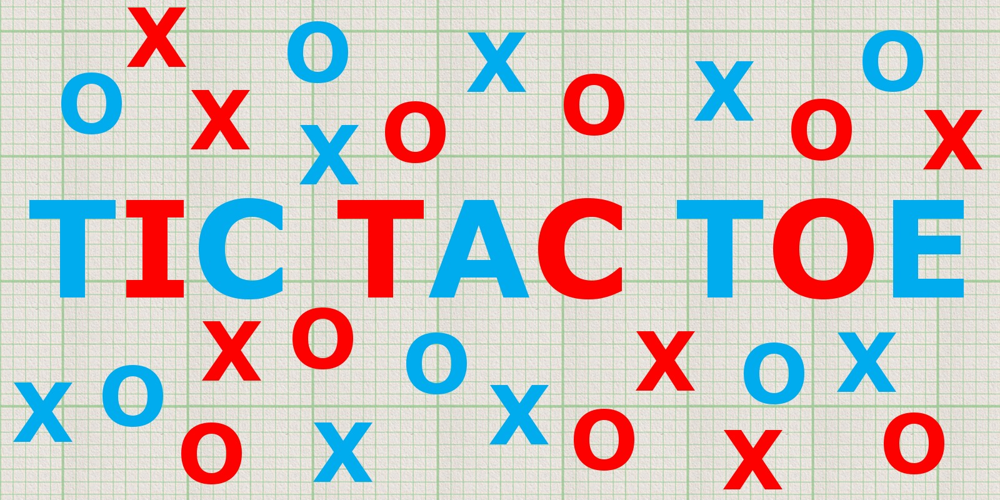

# Tic-Tac-Toe

## Overview
- Simple, quick, and dirty tic-tac-toe game
- For more info: check this [presentation on Prezi](https://prezi.com/slnvxhxg21rp/?token=a2683f7c3406b1aac06a71e77a9bbe616f3d58dd0a67234262893325f1a1848f&utm_campaign=share&utm_medium=copy)

---
## Specifications
- Console C++ Application
- This version is for windows only (Linux will be supported soon).
- Currently the game supports only humans(AI will be provided soon).
- Player 1 is X, and player 2 is O as usual.
---
## How to run?
### 1) Download this repo
- From GitHub: Clone or Download the repository or
- From Git:
    > git clone https://github.com/SuperMoudy/tic-tac-toe

### 2) Go to the project directory and open cmd then type:
> make

### 3) Run the game by typing
> ./tictactoe

---
## Game Instructions
- This is how the game board looks like:

    

- To play your turn, enter a number that corresponds to your desired square and press enter.

- You and your partner take turns this way until one of you win or it's a tie.

    

---
## License:
MIT
